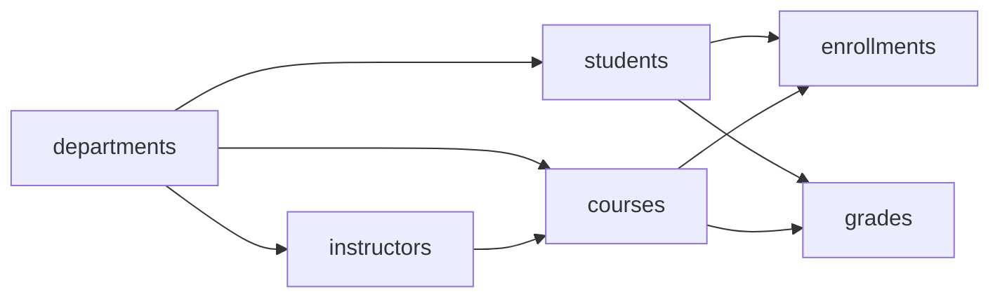

# Database Design: University Students (MongoDB)

## Scope

The data model supports:
- student registration
- course catalog and instructors
- enrollment to courses
- grade assignment per semester
- analytical filters by department, group, and year

## Collections

### `departments`
- `_id` (ObjectId)
- `departmentId` (string, unique)
- `name` (string)
- `faculty` (string)

### `students`
- `_id` (ObjectId)
- `studentId` (string, unique)
- `firstName` (string)
- `lastName` (string)
- `email` (string, unique)
- `departmentId` (string)
- `group` (string)
- `year` (int, 1..6)
- `enrolledAt` (date)
- `status` (string: `active`, `academic_leave`, `graduated`, `expelled`)

### `instructors`
- `_id` (ObjectId)
- `instructorId` (string, unique)
- `firstName` (string)
- `lastName` (string)
- `departmentId` (string)
- `email` (string, unique)

### `courses`
- `_id` (ObjectId)
- `courseId` (string, unique)
- `title` (string)
- `departmentId` (string)
- `credits` (int)
- `semesterOffered` (string, e.g. `2026-Spring`)
- `instructorId` (string)

### `enrollments` (primary sharded collection)
- `_id` (ObjectId)
- `enrollmentId` (string, unique)
- `departmentId` (string)
- `studentId` (string)
- `courseId` (string)
- `semester` (string)
- `enrolledAt` (date)
- `status` (string: `enrolled`, `dropped`, `completed`)

### `grades`
- `_id` (ObjectId)
- `gradeId` (string, unique)
- `studentId` (string)
- `courseId` (string)
- `semester` (string)
- `grade` (string: `A`, `B`, `C`, `D`, `F`, `Pass`, `Fail`)
- `updatedAt` (date)

## Sharding Strategy

Primary sharded collection: `enrollments`.

Shard key:
```js
{ departmentId: 1, studentId: 1 }
```

Rationale:
- `departmentId` provides high-level distribution aligned to common analytical queries.
- `studentId` adds cardinality to avoid large hot chunks inside a department.
- Most operational queries (student schedule, department enrollment scan) include one or both fields.

`students` can remain unsharded early on. If data grows significantly, shard by `{ departmentId: 1, studentId: 1 }` for colocation with `enrollments` access patterns.

## Index Plan

`students`
- `studentId` unique
- `email` unique
- `departmentId + year` compound

`courses`
- `courseId` unique
- `departmentId + semesterOffered`

`enrollments`
- `enrollmentId` unique
- shard key index `{ departmentId: 1, studentId: 1 }`
- query index `{ departmentId: 1, studentId: 1, courseId: 1 }`
- query index `{ semester: 1, departmentId: 1 }`

`grades`
- `gradeId` unique
- `studentId + semester`
- `courseId + semester`

## Query Patterns

1. Find student profile and active enrollments by `studentId`.
2. List students of a department in a specific year.
3. Show all enrollments per department and semester.
4. Calculate GPA-like summary from grades by student.

## Logical Relationship Diagram



